# SIGINT

한국 주식 복합 신호 분석 + 종목 추천 안드로이드 앱.  
백엔드 서버 없이 React Native 단독으로 동작하며, AI 분석은 기기 내 LLM으로 처리한다.

---

## 핵심 기능

| 탭 | 기능 |
|----|------|
| 대시보드 | 관심 종목 추가/삭제(전종목 검색) · 실시간 시세 · PER/PBR/ROE/PCR/P·FCR 밸류에이션 |
| 추천 종목 | 코스피200 + 코스닥150 전체 스캔 → 수급·밸류·모멘텀 복합 스코어 순 정렬 |
| 테마 감지 | 업종 지수 z-score + LLM 뉴스 감성 결합 → 테마 등급(관심/주목/급부상/과열) |
| 알림 빌더 | 7가지 프리셋 + AND/OR 직접 조합 → 로컬 푸시 알림 |
| 설정 | KIS/DART API 키 입력 · LLM 모델 다운로드 상태 |

---

## 아키텍처

```mermaid
flowchart TB
    classDef screen  fill:#0d2137,stroke:#4a9eff,color:#cce4ff
    classDef service fill:#0d2b10,stroke:#3dba5a,color:#c8f0d0
    classDef store   fill:#2b1d08,stroke:#e0953a,color:#ffe5c0
    classDef ext     fill:#2b0c0c,stroke:#e05050,color:#ffd0d0
    classDef cache   fill:#1c0d2b,stroke:#b07ade,color:#e8d4ff
    classDef llm     fill:#0d2228,stroke:#3dbba8,color:#c0f0e8

    subgraph EXT["🌐 외부 서비스"]
        direction LR
        KR["KIS REST API\n현재가 · 재무지표\n업종지수 · 투자자 · 캔들"]:::ext
        KW["KIS WebSocket\nws://21000\n실시간 체결"]:::ext
        DA["DART Open API\n공시 · 뉴스\ncorpCode.xml 전종목"]:::ext
    end

    subgraph SVC["⚙️ Services"]
        direction LR
        kisApi["kisApi.ts\nRate Limiter 200 ms\nAccess Token 자동갱신\nlean 모드 스크리너"]:::service
        kisWS["kisWebSocket.ts\n실시간 구독\n2회 실패 시 재시도 중단"]:::service
        dartSvc["dartApi.ts\nfflate ZIP 파싱\n전종목 리스트 7일 캐시"]:::service
        llmSvc["llmService.ts\nllama.rn 래퍼\n감성분석 · 종목 코멘트"]:::service
        screener["screenerService.ts\n18건 배치 병렬 스캔\n수급 · 밸류 · 모멘텀 스코어"]:::service
        alertEng["alertEngine.ts\nAND / OR 조건 판정\n로컬 알림 발송"]:::service
        themeScorer["themeScorer.ts\n업종 z-score 계산\n테마 등급 산출"]:::service
    end

    subgraph STORE["📦 Zustand Stores"]
        direction LR
        stockSt["stockStore\n관심목록 · 실시간 시세\nAsyncStorage 영속"]:::store
        screenerSt["screenerStore\n스캔 결과 · 진행률\n프리셋 · 필터 · 정렬"]:::store
        themeSt["themeStore\n업종 스코어 · 뉴스"]:::store
        alertSt["alertStore\n알림 조건 목록"]:::store
        llmSt["llmStore\nLLM 다운로드 · 로드 상태"]:::store
    end

    subgraph PERSIST["💾 영속 계층"]
        direction LR
        AS["AsyncStorage\n재무지표 1일\n캔들 · 20일 평균 1일\ncorpCode 맵 7일\nKIS Token 6 h"]:::cache
        SS["expo-secure-store\nKIS App Key / Secret\nDART API Key"]:::cache
    end

    subgraph LLM_BOX["🤖 On-Device LLM (llama.rn)"]
        LLM["Qwen2.5-0.5B-Instruct\nQ4_K_M GGUF · ~380 MB\n기기 내 추론 · 서버 없음"]:::llm
    end

    Notifee["📳 @notifee\n로컬 푸시 알림"]:::cache

    subgraph UI["📱 Screens  (BottomTab 5 + Stack Modal)"]
        direction LR
        S1["대시보드\n관심목록 추가 · 삭제\n실시간 시세 · 등락바"]:::screen
        S2["추천 종목\n7 프리셋 · AND/OR 필터\n수급/밸류/모멘텀 스코어"]:::screen
        S3["테마\n업종 z-score 랭킹\nLLM 감성 뉴스 피드"]:::screen
        S4["알림 빌더\n조건 편집 · 내 알림"]:::screen
        S5["설정\nAPI 키 · LLM 다운로드"]:::screen
        SD["종목 상세 ─ Modal\n캔들차트 · 호가창\nPER/PBR/ROE/PCR/P·FCR\n투자자 가집계 · AI 코멘트"]:::screen
    end

    %% 외부 → 서비스
    KR -->|REST| kisApi
    KW -->|WS 메시지| kisWS
    DA -->|HTTP ZIP / JSON| dartSvc

    %% 서비스 ↔ 영속
    kisApi  <-->|캐시 읽기·쓰기| AS
    kisApi  <-->|API 키 조회| SS
    dartSvc <-->|corp맵 · 종목 목록| AS
    dartSvc <-->|API 키 조회| SS

    %% 서비스 → 스토어
    kisApi  --> stockSt
    kisWS   --> stockSt
    dartSvc --> themeSt
    screener    --> screenerSt
    themeScorer --> themeSt
    alertEng    --> alertSt
    alertEng    --> Notifee
    llmSvc      --> llmSt

    %% 스크리너 → kisApi (lean 모드)
    screener -->|getScreenerDataFast\n4건 / 종목| kisApi

    %% LLM
    llmSvc <--> LLM

    %% 스토어 → 화면
    stockSt     --> S1
    stockSt     --> SD
    screenerSt  --> S2
    themeSt     --> S3
    alertSt     --> S4
    llmSt       --> S5
    llmSvc      --> SD
    llmSvc      --> S3
```



**서버리스 원칙**: 모든 연산(API 호출, AI 추론, 알림 판정)이 앱 내에서 완결된다.

---

## 프로젝트 구조

```
src/
├── types/
│   ├── stock.ts          # StockData, RealtimeQuote 등
│   ├── theme.ts          # ThemeScore, NewsItem, SentimentResult
│   ├── alert.ts          # AlertCondition, AlertPreset, UserAlert
│   ├── screener.ts       # RecommendStock, ScoreBreakdown, ScreenerState
│   └── llm.ts            # LlmStatus, LlmState
│
├── constants/
│   ├── stockUniverse.ts  # 코스피200 + 코스닥150 종목 코드 (350개)
│   └── alertPresets.ts   # 7가지 복합 신호 프리셋 정의
│
├── services/
│   ├── kisApi.ts         # KIS REST — 현재가 / 재무지표 / 업종 / 가집계
│   ├── kisWebSocket.ts   # KIS 실시간 체결 WebSocket (자동 재연결)
│   ├── dartApi.ts        # DART 공시 뉴스 수집
│   ├── llmService.ts     # llama.rn 래퍼 — 다운로드 / 로드 / 추론
│   ├── themeScorer.ts    # 테마 스코어 계산 (z-score 기반)
│   ├── alertEngine.ts    # 복합 조건 판정 + Notifee 알림 발송
│   └── screenerService.ts# 전체 종목 배치 스캔 + 스코어 계산
│
├── store/                # Zustand 전역 상태
│   ├── stockStore.ts     # 관심 종목 · 실시간 시세
│   ├── themeStore.ts     # 테마 스코어 · 뉴스
│   ├── alertStore.ts     # 알림 조건 목록
│   ├── screenerStore.ts  # 스크리너 결과 · 진행률
│   └── llmStore.ts       # LLM 로드 상태
│
├── hooks/
│   ├── useRealTimePrice.ts  # KIS WS 구독 → 스토어 업데이트
│   ├── useThemeAnalysis.ts  # 5분 주기 뉴스 + LLM 분석
│   ├── useAlertBuilder.ts   # 알림 빌더 편집 상태
│   ├── useScreener.ts       # 스크리너 실행 · 정렬 · 필터
│   └── useLlmModel.ts       # 모델 다운로드 → 로드 흐름
│
├── screens/
│   ├── DashboardScreen.tsx      # 관심 종목 리스트
│   ├── RecommendScreen.tsx      # 스크리너 결과 + 프리셋 선택
│   ├── ThemeScreen.tsx          # 업종 스코어 + 뉴스 피드
│   ├── AlertBuilderScreen.tsx   # 프리셋 선택 · 조건 편집 · 내 알림
│   ├── SettingsScreen.tsx       # API 키 입력 · 모델 상태
│   └── StockDetailScreen.tsx    # 캔들차트 · 밸류에이션 · 투자자 · AI 코멘트
│
├── components/
│   ├── common/     KpiCard · GaugeBar · ValuationBar · InvestorBar · NewsItem
│   ├── chart/      CandleChart
│   ├── theme/      ThemeCard · SectorBar
│   ├── alert/      ConditionCard · OpConnector · PresetButton
│   ├── recommend/  StockScoreCard · ScoreBreakdown · PresetFilter · ScanProgress
│   └── llm/        ModelDownloader · AiInsightBox
│
├── navigation/
│   └── index.tsx   # BottomTab 5개 + StockDetail Stack (modal)
│
└── theme/
    └── colors.ts   # 다크 테마 색상 토큰
```

---

## 종목 추천 스코어 (100점 만점)

```
수급  40점 │ 외국인 연속 순매수(최대 20) · 기관 순매수(10) · 체결강도(최대 10)
밸류  35점 │ PBR 섹터 대비(최대 15) · PER(최대 10) · P/FCR(최대 10)
모멘텀 25점│ 거래량 급증(최대 10) · 업종지수 상승(최대 10) · 테마 등급(5)
```

---

## 알림 프리셋 7종

| 프리셋 | 핵심 조건 | 신뢰도 |
|--------|-----------|--------|
| 스마트머니 집결 | 외국인 3일 연속 + 기관 순매수 + 저PBR | ★★★★★ |
| 가치 바닥 전환 | PER·PBR·P/FCR 동시 저평가 + 외국인 전환 | ★★★★★ |
| 기관 선행 매수 | 기관 3일 연속 + 저PBR + 체결강도 110↑ | ★★★★ |
| 모멘텀 폭발 | 체결강도 140↑ + 거래량 2배 + 외국인 매수 | ★★★★ |
| 고점 돌파 확인 | 체결강도 130↑ + 거래량 1.8배 + KOSPI 아웃퍼폼 | ★★★★ |
| 테마 초입 포착 | 업종 2%↑ + 체결강도 120↑ + 거래량 1.5배 | ★★★ |
| 과매도 반등 | 5일 낙폭 -5% + 저PBR + 외국인 전환 매수 | ★★★ |

---

## 온디바이스 LLM

| 항목 | 내용 |
|------|------|
| 모델 | Qwen2.5-0.5B-Instruct Q4_K_M (GGUF) |
| 크기 | ~380MB (앱 번들 미포함, 설정 화면에서 Wi-Fi 다운로드) |
| 추론 속도 | 5~15 토큰/초 (RAM 4GB 이상 권장) |
| 역할 | 뉴스 감성 분석 → `{sentiment, urgency, summary}` JSON 출력 |
|      | 종목 AI 코멘트 → 한 문장 자연어 생성 |
| 제약 | Expo Go 불가, Dev Build(`npx expo run:android`) 전용 |

---

## 외부 API

### KIS Open API
- 발급: [https://apiportal.koreainvestment.com](https://apiportal.koreainvestment.com)
- 사용: 현재가, 체결강도, 투자자별 가집계, PER/PBR, 업종지수, FCF
- 인증: Access Token 6시간 캐시 → 자동 갱신

### DART Open API
- 발급: [https://opendart.fss.or.kr](https://opendart.fss.or.kr)
- 사용: 최신 공시 뉴스 수집 (테마 감성 분석 소스)

> API 키 없이도 **Mock 데이터**로 전체 UI가 정상 동작한다.  
> 키는 설정 화면에서 입력하며 `expo-secure-store`에 암호화 저장된다.

---

## 캐시 전략

| 데이터 | 갱신 주기 | 저장소 |
|--------|-----------|--------|
| 재무지표 (PER/PBR/P/FCR) | 하루 1회 | AsyncStorage |
| 업종 평균 (비교 기준값) | 하루 1회 | AsyncStorage |
| 업종 변화율 히스토리 | 누적 최대 20일 | AsyncStorage |
| 실시간 체결 · 거래량 | 스캔 시 직접 조회 | — |
| KIS Access Token | 6시간 | AsyncStorage |
| API 키 | 영구 | expo-secure-store |

---

## 빌드

```bash
# 의존성 설치
npm install

# Android 네이티브 폴더 생성 (최초 1회)
npx expo prebuild --platform android

# Dev Build 실행 (에뮬레이터 또는 USB 기기)
npx expo run:android
```

### 환경 요구사항

| 항목 | 권장 버전 |
|------|-----------|
| Node.js | 20 LTS 또는 22 LTS |
| JDK | 17 (Amazon Corretto 17) |
| Android SDK | compileSdk 36 / targetSdk 35 / minSdk 26 |
| Android Studio | Hedgehog 이상 |

> **주의**: `llama.rn`과 `@notifee/react-native`는 네이티브 모듈이므로 **Expo Go에서 실행 불가**.

---

## 기술 스택

| 영역 | 라이브러리 |
|------|-----------|
| 프레임워크 | React Native 0.81 · Expo 54 |
| AI 추론 | llama.rn 0.12 · Qwen2.5 0.5B Instruct GGUF |
| 상태 관리 | Zustand 5 |
| 네비게이션 | React Navigation 7 (Stack + BottomTab) |
| 알림 | @notifee/react-native 9 |
| 파일 I/O | react-native-fs |
| HTTP | axios |
| 보안 저장소 | expo-secure-store |
| 타입 | TypeScript 5.9 strict mode |
